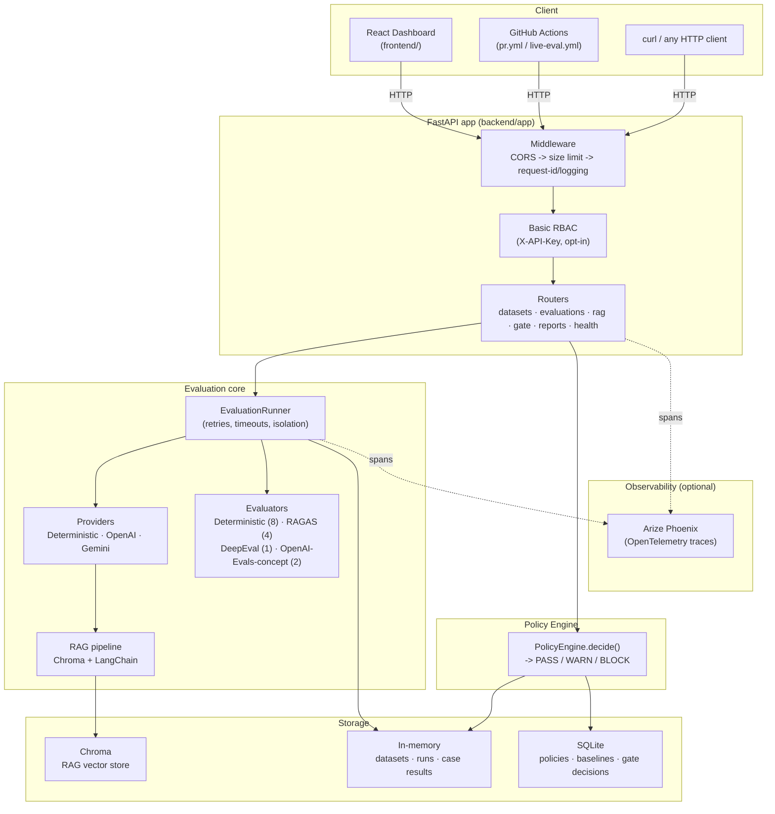
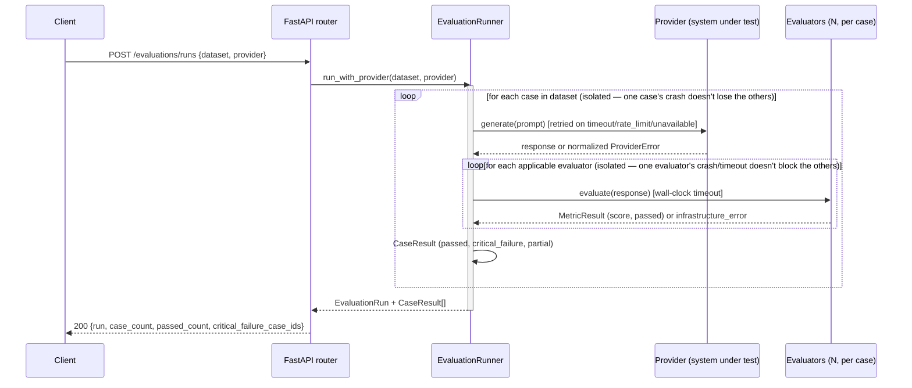
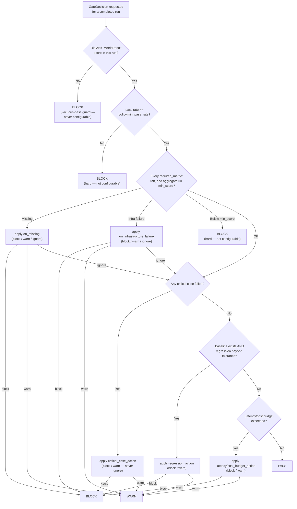

# Architecture

This is the system-design companion to [`README.md`](README.md) (the
pitch and quick start) and [`DECISIONS.md`](DECISIONS.md) (the full,
dated rationale behind every individual choice, numbered #1–#38). Read
this for *how the pieces fit together*; read `DECISIONS.md` when you want
to know *why one specific piece looks the way it does*.

## System overview

Everything inside **Core** and **Policy** is pure Python, synchronous,
and has no network dependency of its own except the live provider/judge
HTTP calls it deliberately makes. **Storage** is intentionally split:
golden datasets, runs, and case results are in-memory (fast, simple,
reset on restart — see "What is deliberately not built?" in the README);
policies/baselines/gate-decisions are SQLite (the audit trail that
actually needs to survive a restart). **Observability** is entirely
optional and additive — nothing in Core or Policy changes behavior
based on whether Phoenix is reachable.

## Evaluation pipeline

Every evaluator — deterministic, RAGAS, DeepEval, or the
OpenAI-Evals-concept adapters — is invoked through the exact same two
wrapping points (`_generate_with_span` / `_evaluate_with_span` in
`app/evaluation/runner.py`), so retries, timeouts, tracing spans, and
failure isolation apply identically regardless of which framework
produced a given metric. No framework ever sees another framework's
code, and none of them computes PASS/WARN/BLOCK — see "Why multiple
evaluation frameworks?" in the README.

## PASS / WARN / BLOCK decision flow

A run can accumulate multiple WARN-level reasons; any single hard-BLOCK
condition or any condition configured to `block` ends the evaluation at
BLOCK regardless of what else was checked. `PolicyEngine.decide()`
(`app/policy/engine.py`) is the **only** function in the entire codebase
that produces this status — see `DECISIONS.md` #28 for why three of
these checks (vacuous-pass, pass-rate, required-metric-below-threshold)
are hard-coded rather than policy-configurable.

## Layer-by-layer

| Layer | Package | Owns | Never does |
|---|---|---|---|
| Domain | `app/domain/` | Pydantic models: `EvaluationCase`, `CaseResult`, `EvaluationRun`, `MetricResult`, `ReleasePolicy`, `GateDecision`, `Baseline` | Any logic — pure data + validation |
| Providers | `app/providers/` | Talking to a system under test (`DeterministicProvider`/`OpenAIProvider`/`GeminiProvider`), normalizing every SDK's exceptions into `ProviderError` | Grading a response |
| Evaluation | `app/evaluation/` | `EvaluationRunner` (orchestration, retries, timeouts, isolation, tracing) + 4 evaluator frameworks, each isolated behind its own `*Client` | Computing PASS/WARN/BLOCK |
| RAG | `app/rag/` | Chunking, embedding, Chroma storage/retrieval, prompt assembly — a *system under test*, not the Gate itself | Being the thing being graded for quality — it's an example target |
| Policy | `app/policy/` | `PolicyEngine.decide()` — the only PASS/WARN/BLOCK logic in the codebase | Calling any evaluator, provider, or framework SDK |
| Reports | `app/reports/` | Read-only JSON/HTML export of an existing `GateDecision` | Writing to any repository or changing an outcome |
| Observability | `app/observability/` | Optional OpenTelemetry/Phoenix tracing, degrades to a no-op silently | Anything `app/policy/` depends on |
| Reliability | `app/reliability/` | Bounded provider-call retries | Retrying evaluators (isolation + timeout cover that differently — see `EVALUATION_STRATEGY.md`) |
| Repositories | `app/repositories/` | Storage abstraction: `InMemoryRepository[T]` (datasets/runs/case-results) and `SQLiteRepository[T]` (policies/baselines/decisions) | Business logic |
| API | `app/api/` | FastAPI routers, request/response shaping, the basic RBAC boundary | Business logic (delegates everything to a service) |
| Core | `app/core/` | Settings, structured JSON logging + secret redaction, request-id middleware, request-size limit, auth abstraction, the `AppError` family | Anything evaluation/policy-specific |

## Technology choices

| Choice | Why | Trade-off accepted |
|---|---|---|
| **FastAPI + Pydantic** | Request/response validation, OpenAPI docs, and domain modeling share one library; async-ready if ever needed, synchronous works fine today since every call in this pipeline is one request → one evaluation. | Pydantic model overhead on every object; negligible at this scale. |
| **uv** (not pip/poetry) | Fast, reliable lockfile-based dependency resolution; `uv sync --frozen` in Docker builds are reproducible and fast. | Less universally known than pip; every doc in this repo shows exact `uv` commands to offset that. |
| **SQLite** (not Postgres) for policies/baselines/decisions | Zero operational overhead for a reference implementation; `:memory:` default means tests never share state. | Not a real production datastore — see "What changes at 10x scale?" in the README. |
| **In-memory** for datasets/runs/case-results | Matches the SQLite reasoning above — simplicity over durability for data that (today) exists for the lifetime of one deployment. | A restart loses every run that wasn't gated+baselined; a real deployment would need this in SQLite/Postgres too (see Outstanding Work in `PROJECT_STATE.md`). |
| **Four separate evaluation-framework clients** rather than one unified SDK wrapper | Each framework (RAGAS, DeepEval, OpenAI's Responses API) has an incompatible dependency graph and its own exception taxonomy (`DECISIONS.md` #21 documents one real version conflict this caused); isolating each behind its own `*Client` module means one framework's SDK upgrade can never break another's. | Some structural repetition across the four client modules (each maps its own SDK's exceptions to the same normalized shape) — a deliberate trade-off, not an oversight; see `EVALUATION_STRATEGY.md`. |
| **OpenTelemetry + Arize Phoenix** for tracing | Vendor-neutral wire format; Phoenix adds an LLM-aware UI (spans for retrieval/generation/evaluation render meaningfully) without this codebase depending on Phoenix's own SDK anywhere outside `app/observability/`. | An extra moving part for local dev if you want to see traces (a separate `phoenix serve`/Docker container) — fully optional, degrades to a no-op tracer with zero behavior change otherwise. |
| **React + Vite + TypeScript**, no heavier framework | Five mostly-independent, mostly-read-only views with no complex shared state; a 25-line `useApiData` hook covers every page's loading/error/data needs. | No built-in caching/dedup across navigations — acceptable for an internal tool polled by a handful of engineers (`DECISIONS.md` #32). |
| **Docker multi-stage builds, non-root, health-checked** | Reproducible builds, smaller final images, and a container that never runs as root even in the common case. | Slightly more Dockerfile complexity than a single-stage `COPY . .` would need. |
| **GitHub Actions, deterministic-by-default** | Every PR check uses `DeterministicProvider` — zero cost, zero flakiness from a third-party API, zero secrets required for 99% of CI runs. | A separate, manual-only workflow is needed for real-provider validation (`docs/ci-cd.md`) — more moving parts than "just always call the real API," but it's what makes the common case free and safe. |

## Trade-offs, named explicitly

- **Synchronous, not async, request handling.** Every evaluation run is
  CPU/IO-bound in a way that doesn't benefit from asyncio concurrency at
  this system's expected scale (one engineer triggering one run and
  waiting for the result) — see "What changes at 10x scale?" for when
  this would need to change.
- **In-process evaluator execution, isolated by thread + try/except, not
  by subprocess.** A hung evaluator's thread is abandoned (not killed —
  Python cannot do that safely) rather than forcibly terminated. The
  caller never blocks waiting for it, which is the property that
  actually matters; see `DECISIONS.md` #38 for the full reasoning and
  `SECURITY.md` for the operational implication.
- **A single shared-secret API key, not per-user RBAC.** Deliberately
  "basic" — see `DECISIONS.md` #37 and `SECURITY.md`.
- **No message queue, no background worker.** Every evaluation run
  completes synchronously within one HTTP request. Fine for a dataset of
  tens of cases against a fast provider; would need to become
  asynchronous (submit a run, poll/webhook for completion) well before a
  dataset of thousands of cases against a slow, real provider — see
  "What changes at 10x scale?" in the README.
