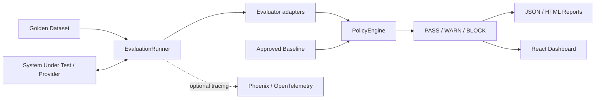

# AI Quality Gate

A production-oriented reference implementation for evaluating LLM and RAG applications before release. It runs versioned golden datasets, normalizes signals from deterministic and model-based evaluators, compares results with policy and approved baselines, and returns an auditable **PASS / WARN / BLOCK** decision.

This repository is an engineering reference project, not a production-deployed service.

## What it does

The Quality Gate separates **evaluation signals** from **release policy**. RAGAS, DeepEval, OpenAI-model graders, and deterministic checks produce normalized `MetricResult`s. The platform-owned `PolicyEngine` decides whether a run can ship.

Core capabilities:

- Versioned golden datasets with critical cases
- Deterministic checks for exact/phrase/schema/refusal/citation/latency/cost behavior
- OpenAI and Gemini providers behind a provider-neutral interface
- Sample LangChain + Chroma RAG workload used as a system under test
- RAGAS, DeepEval, and OpenAI-model graders behind evaluator adapters
- Baselines, regression detection, latency/cost budgets, and PASS/WARN/BLOCK policy
- Optional Phoenix/OpenTelemetry tracing
- JSON/HTML reports and a React engineering dashboard
- Deterministic GitHub Actions CI, optional live-provider workflow, and Docker packaging
- Request limits, redacted logging, bounded retries, evaluator timeouts, readiness checks, and a basic write-auth boundary

## Architecture



The important boundary is deliberate: **frameworks provide signals; the Quality Gate owns release policy.** Phoenix observes execution but never participates in the decision.

See [ARCHITECTURE.md](ARCHITECTURE.md) for component, evaluation-pipeline, and decision-flow diagrams.

## Evaluation model

A run loads a named/versioned golden dataset, sends each case through a provider, and applies the evaluators that are relevant to that case. Evaluator outputs are normalized into the same internal model regardless of framework. Infrastructure failures are represented separately from quality failures, so a rate limit or judge timeout is not treated as a bad model answer.

The policy engine then evaluates pass rate, required metrics, critical cases, baseline regressions, latency/cost budgets, and evaluator availability. A run with no scored metrics cannot pass.

See [EVALUATION_STRATEGY.md](EVALUATION_STRATEGY.md) for the framework and policy rationale.

## Repository structure

```text
ai-quality-gate/
├── README.md
├── ARCHITECTURE.md
├── EVALUATION_STRATEGY.md
├── SECURITY.md
├── PROJECT_STATE.md
├── DECISIONS.md
├── docker-compose.yml
├── .github/workflows/       # deterministic PR CI + manual live evaluation
├── docs/                    # CI/CD and Phoenix debugging guides
├── scripts/smoke_test.sh
├── frontend/                # React + TypeScript dashboard
└── backend/
    └── app/
        ├── domain/
        ├── providers/
        ├── evaluation/
        ├── rag/
        ├── policy/
        ├── reports/
        ├── observability/
        ├── reliability/
        ├── repositories/
        ├── services/
        ├── api/
        └── core/
```

## Run locally

With Docker:

```bash
cp .env.example .env
docker compose up --build
```

Backend: `http://localhost:8000`  
Dashboard: `http://localhost:5173`

Without Docker:

```bash
cd backend
uv sync
uv run uvicorn app.main:app --reload
uv run pytest -v
uv run ruff check .
```

```bash
cd frontend
npm install
npm run dev
npm test
npm run build
```

All supported environment variables and safe defaults are documented in [.env.example](.env.example). Real providers, model-based evaluators, authentication, and Phoenix tracing are opt-in.

## Sample evaluation

```bash
curl -X POST http://localhost:8000/api/v1/evaluations/runs \
  -H "Content-Type: application/json" \
  -d '{"dataset_name":"customer_support_bot","dataset_version":"1.1.0"}'
```

The bundled deterministic dataset contains 40 cases. Its fixture run intentionally includes failures so the gate can demonstrate critical-case and release-policy behavior. Run the gate with the returned run id:

```bash
curl -X POST http://localhost:8000/api/v1/gate/decisions \
  -H "Content-Type: application/json" \
  -d '{"run_id":"<run-id>"}'
```

A decision can be exported as JSON or HTML through `/api/v1/reports/{decision_id}/json` and `/html`.


## Testing and CI

The backend uses PyTest; the frontend uses Vitest and React Testing Library. Tests cover domain validation, datasets, provider contracts, evaluator adapters, RAG, policy decisions, reports, observability boundaries, API behavior, security/reliability paths, and the dashboard.

Every PR runs deterministic checks without paid model calls: lint/format, backend tests, API/integration tests, frontend tests, an end-to-end smoke test against a running service, Docker build validation, coverage, and dependency scans. A separate manual workflow can run a controlled live-provider evaluation using repository secrets and uploads reports as artifacts. See [docs/ci-cd.md](docs/ci-cd.md).

## Observability

When enabled, OpenTelemetry traces expose the run as nested spans for cases, provider calls, RAG retrieval/generation, and evaluator execution. Trace IDs are correlated with run and gate records. If Phoenix is unavailable, tracing degrades without changing release behavior. See [docs/debugging-failed-runs.md](docs/debugging-failed-runs.md).

## Production gaps and trade-offs

The project intentionally stops short of claiming production deployment. Current limitations include:

- Datasets, evaluation runs, and case results are in memory; policies, baselines, and gate decisions use SQLite.
- Write access can be protected by one shared API key, not per-user RBAC.
- TLS termination, rate limiting, and a production identity/audit system are outside this repository.
- Request-size enforcement relies on `Content-Length`, so chunked transfer is a known gap.
- Evaluator timeouts stop the caller from waiting but cannot forcibly kill an already-running Python thread.
- Evaluation is synchronous; higher scale would require durable storage, async job execution, connection pooling, and horizontal scaling.

See [SECURITY.md](SECURITY.md) for the security boundary and [DECISIONS.md](DECISIONS.md) for the major architectural trade-offs.

## Documentation

- [ARCHITECTURE.md](ARCHITECTURE.md) — system design, data flow, decision flow, technology choices
- [EVALUATION_STRATEGY.md](EVALUATION_STRATEGY.md) — evaluator responsibilities, failure semantics, baselines, release policy
- [SECURITY.md](SECURITY.md) — implemented controls and known limitations
- [docs/ci-cd.md](docs/ci-cd.md) — deterministic and live CI workflows
- [docs/debugging-failed-runs.md](docs/debugging-failed-runs.md) — trace-based debugging
- [PROJECT_STATE.md](PROJECT_STATE.md) — concise current-state handoff
- [DECISIONS.md](DECISIONS.md) — architectural decision record
